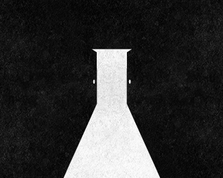

<h1 align="center">Escape-Door</h1>


</div>
<br /><br />

逃生出口的一线光<br />

逃出了脆弱便强壮<br />

于此逃找宣泄的出口
## Project setup
```
npm install
```

### Compiles and hot-reloads for development
```
npm run serve
```

### Compiles and minifies for production
```
npm run build
```

### Lints and fixes files
```
npm run lint
```

### Customize configuration
See [Configuration Reference](https://cli.vuejs.org/config/).
